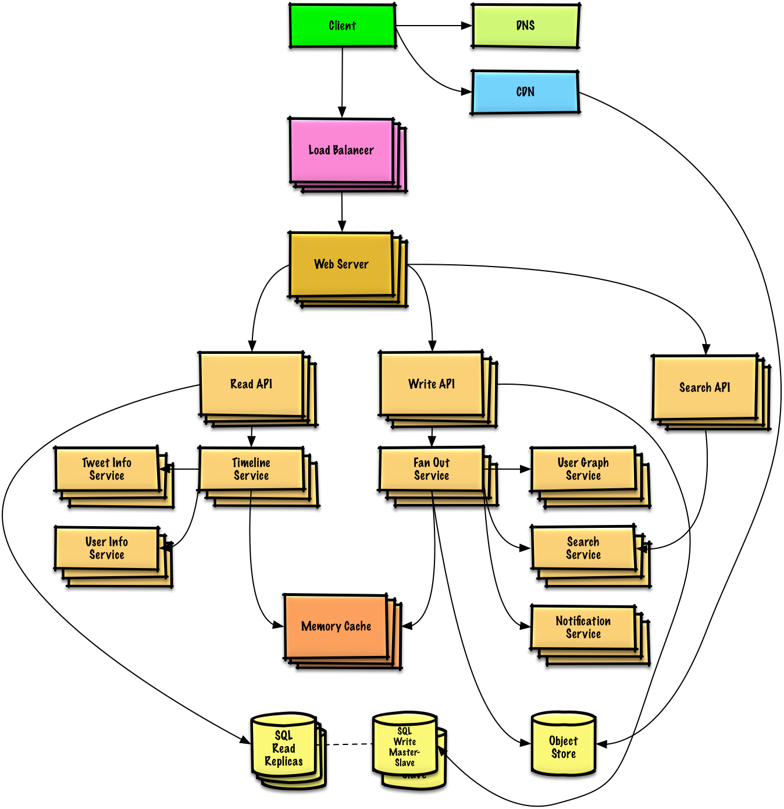

- Client - User or device making requests to server
- DNS(Domain Name System) - Websites are found using domains (e.x. github.com) DNS is a collection of servers that contain the translation of these domains to IP addresses used to find the actual resources
- CDN(Content Deliver Network) - Collection of servers that stores website static content (images, videos etc ) to increase speed of website loading incase the client is far from the host server
- Load Balancer - A device and/or software that distributes incoming traffic across server instances
- Web Server - A program ( or many programs ) that process the clients request and perform the necessary actions to deliver content to the client
- Read/Write/Search API (Application Programming Interface ) - Rules that allow software (I.E. client/browsers -> server) to interact this can be *writing* new data, *reading* data, *searching* for data etc.
- Services  (Micro-services) -  Programs separate from the server that have their own responsibility and talk to the server through an API
- Cache (Local/Distributed) - Technique to store and retrieve frequently used data 
- Object Store - Storage for unstructured data ( images, videos)
- Read/Write Replicas - Databases are replicas (copies) are used to make the database more consistent and increase performance
	- Read replicas handle read only queries reducing load on the main system
	- Write replicas are where writes happen ensuring consistency and pushing to read replicas
